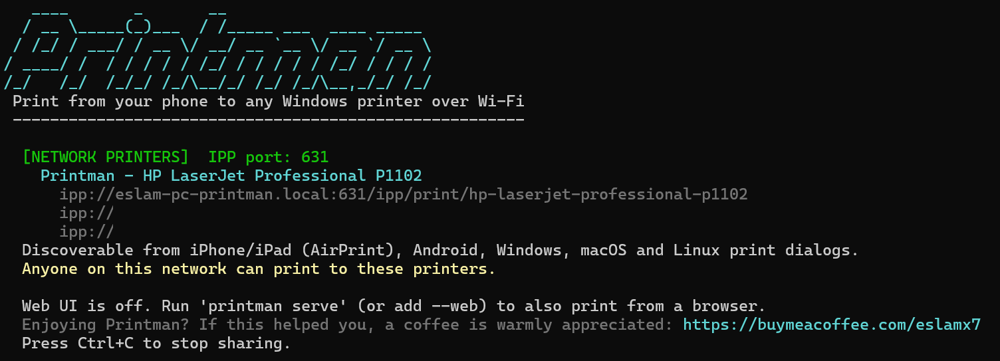
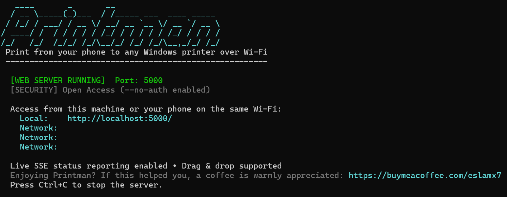
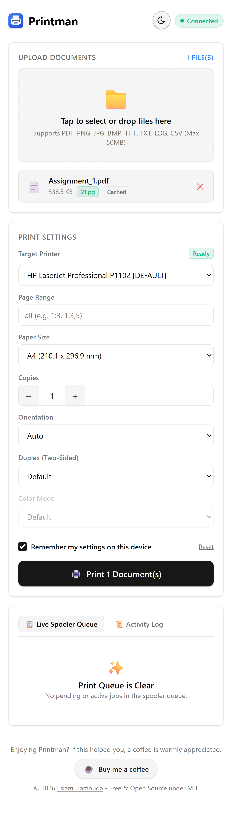
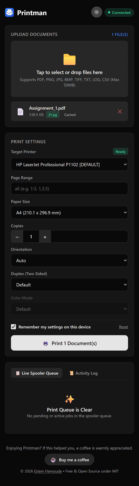
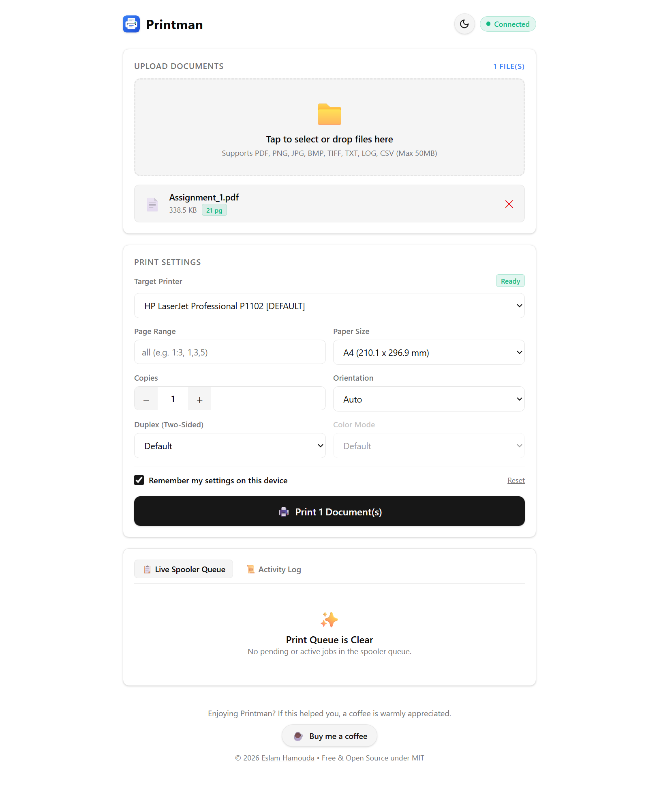
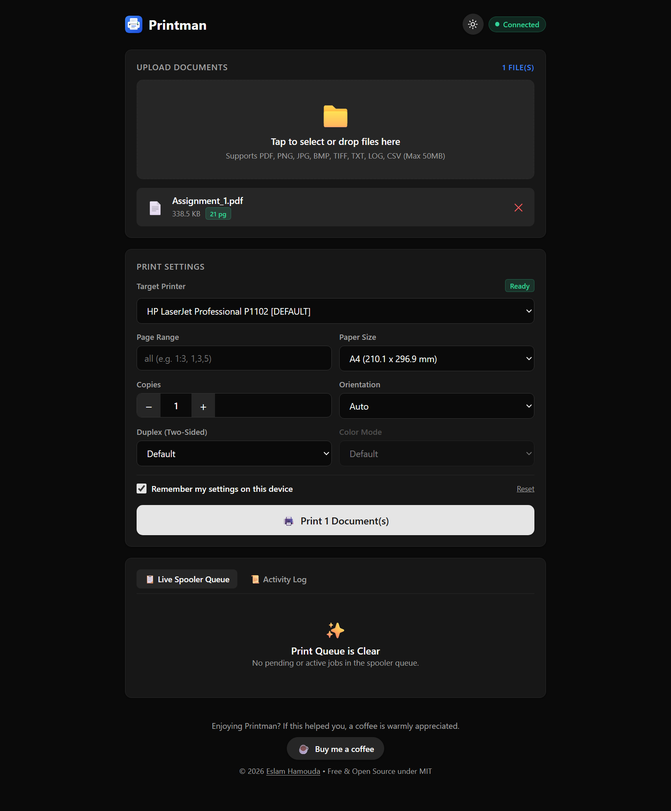

# Printman 🖨️

[](https://dotnet.microsoft.com/)
[](LICENSE)
[]()
[]()
[](https://github.com/EslaMx7/printman/releases/latest)
[](https://buymeacoffee.com/eslamx7)

Give your old USB printer real Wi-Fi superpowers. A small, zero-dependency tool for Windows, Linux, macOS and Raspberry Pi that turns any USB printer into a **native network printer** - it appears in the print dialog of iPhone, iPad, Android, Windows, macOS and Linux, and works without installing an app, a driver or a cloud account.

---

## ⚡ TL;DR

**Turn your USB printer into a real Wi-Fi printer. One command, nothing to install:**

```powershell
printman.exe share
```

Then open the print dialog on any device on the same Wi-Fi and pick **`Printman - <your printer>`**. It simply appears like a normal network printer, with nothing to install.

**Prefer printing from a browser instead?** Run `printman.exe serve` and open the link it shows on your phone.

---

## 🌐 A real Wi-Fi printer, in one command

`printman share` turns your Windows PC, Mac, Linux box or Raspberry Pi into an IPP Everywhere / AirPrint print server. Your USB printer stops being "the one that needs the computer" and becomes a normal printer on your network - discoverable by every phone and laptop, with no software to install anywhere.

<p align="center">
  <a href="docs/images/printman_desktop_cli_share_dark.png">
    
  </a>
</p>

```powershell
printman.exe share                      # share the default printer
printman.exe share "HP Laser" "Canon"   # share specific printers (partial names work)
printman.exe share --select             # pick printers from a checklist
printman.exe share --all                # share every installed printer
```

**It shows up where you already print:**

| Your device | How to print |
| :--- | :--- |
| **iPhone / iPad** | AirPrint - Share -> Print -> pick `Printman - <printer>` |
| **Android** | Mopria / Default Print Service - Print -> select the printer |
| **Windows 10 / 11** | Settings -> Bluetooth & devices -> Printers & scanners -> Add device |
| **macOS** | Add Printer -> Default (Bonjour) |
| **Linux / ChromeOS** | Appears automatically as a driverless (IPP Everywhere) printer |

**Why it is different**

- **Nothing to install, and nothing leaves your network.** Printman uses the same IPP Everywhere and mDNS (Bonjour) standards as a Wi-Fi printer, so devices need no app or driver and no cloud account is involved.
- **One command.** No configuration on the PC, nothing to install on the phones.
- **Zero dependencies.** Pure .NET + the OS print system (Windows APIs, or CUPS on Linux / macOS) - the same binary also handles PDF, JPEG/PNG, PWG Raster and Apple URF jobs.
- **One queue.** Network jobs appear in the same live spooler dashboard as web uploads (and can be cancelled there).
- **Private by default.** Only private / LAN addresses are accepted; nothing ever leaves your network.

> [!IMPORTANT]
> Native print dialogs cannot type a PIN, so **anyone on your local network can print to shared printers** (exactly like a normal Wi-Fi printer). PIN protection still applies to the web UI (`serve` / `share --web`).

### 🧭 Network printer vs. web UI

| | `printman share` - Network printer | `printman serve` - Web UI |
| :--- | :--- | :--- |
| Where you print from | Any app's **normal print dialog** | A **web page** you open in a browser |
| Install on the device | **Nothing** | Nothing (just open the link) |
| Works with | iPhone/iPad, Android, Windows, macOS, Linux | Any browser |
| PIN / authentication | Not possible (prints like a real printer) | Yes - PIN protected |
| Best for | Everyday printing from phones and laptops | Uploading files, live queue, diagnostics |

**Want both?** `printman share --web` (or `printman serve --share`) runs the network printer and the web UI in one process.

---

## 💡 Why Printman?

> *"Do not replace reliable hardware. Modernize the access layer."*

* **The Story:**  
  In 2014, I bought an **HP LaserJet Professional P1102** printer. For more than 12 years, this printer moved with my family to every new home. The hardware has never broken down or failed. One toner cartridge provides three years of continuous use. It is durable, economical, and dependable.

* **The Problem:**  
  The printer has one major limitation: it requires a direct USB connection to a Windows computer. Drivers for macOS and Linux are no longer supported.  
  During the school season, our children need printed homework and study sheets from school. The daily workflow was slow:
  1. Download the document on a phone or iPad.
  2. Transfer the file to the desktop computer.
  3. Log in to the desktop and start the print job manually.  

* **The Solution:**  
  Modern Wi-Fi printers are often fragile, expensive, and dependent on cloud accounts. Instead of replacing functional hardware, I built **Printman**.  
  Printman turns the host Windows machine into a lightweight, zero-dependency print server. With `printman share`, our 12-year-old USB printer now appears as a normal Wi-Fi printer in every phone and laptop's print dialog; `printman serve` adds a phone-friendly web UI.  
  Now, my wife prints assignments from her phone and my kids print their homework from their iPad directly, without installing anything on their devices or replacing the printer.

---

## 🌟 What It Does

- **⭐ Real Network Printer (AirPrint / Mopria / IPP Everywhere):** Run `printman share` and your printer appears as `Printman - <printer>` in the **native print dialog** of iPhones, iPads, Android phones, Windows, macOS and Linux, with nothing to install on the device and no cloud account required.
- **Phone-Ready Web UI:** Run `printman serve` to launch a mobile web page. Anyone on your home Wi-Fi can open it and print from their phone.
- **Zero Extra Installs:** Built entirely on the .NET runtime and the operating system's own printing: Windows printing APIs on Windows, CUPS on Linux, macOS and Raspberry Pi OS. No third-party packages or bloated drivers (assuming the printer itself is installed).
- **Prints Common Formats:** Handles PDF documents, images (`.png`, `.jpg`, `.bmp`), and plain text or code files (`.txt`, `.csv`, `.md`, `.json`).
- **Live Spooler & Hardware Diagnostics:** Interrogates the native print queue (Windows Spooler or CUPS) and hardware status flags in real time (Paper Jam, Out of Paper, Offline, Door Open, Busy, Paused).
- **Duplicate Prevention & Queue Control:** Proactively warns before submitting duplicate print jobs when jobs are pending/stuck; allows canceling individual jobs or purging all jobs in one click.
- **Two CLI Modes:** Pass command-line flags to print immediately, or run `printman` with no arguments to use a guided interactive terminal wizard.
- **Smart Printer Search:** Type partial printer names. For example, `HP Laser` automatically finds `HP LaserJet Professional P1102`.
- **Full Print Controls:** Set page ranges (e.g. `1:3`, `2,5`), paper sizes (`A4`, `Letter`), copies, orientation, duplex, and color mode.

---

## 📥 Download

Pre-built binaries are available on [**GitHub Releases**](https://github.com/EslaMx7/printman/releases/latest):

| Package | Details |
| :--- | :--- |
| [**Windows Standalone ZIP**](https://github.com/EslaMx7/printman/releases/latest) ⭐ *(Recommended)* | `win-x64`: single executable (~60 MB), (no .NET required) |
| [**Windows Portable ZIP**](https://github.com/EslaMx7/printman/releases/latest) | Lightweight (~6 MB), requires [.NET 10 Desktop Runtime](https://dotnet.microsoft.com/download) |
| [**Linux tar.gz**](https://github.com/EslaMx7/printman/releases/latest) | `linux-x64`, `linux-arm64` (Raspberry Pi 3/4/5 with 64-bit OS), `linux-arm` (Raspberry Pi 2/3/4 with 32-bit OS): single executable, no .NET required |
| [**macOS tar.gz**](https://github.com/EslaMx7/printman/releases/latest) | `osx-arm64` (Apple Silicon), `osx-x64` (Intel): single executable, no .NET required |
> **Quick Start (Windows):** Extract the ZIP file and run `printman.exe` directly or from Windows Terminal.
>
> **Quick Start (Linux / Raspberry Pi):** Printman prints through CUPS. Install it and add your printer once (`sudo apt install cups`, then add the printer in your desktop's printer settings or at `http://localhost:631`), then extract and run `./printman`.
>
> **Quick Start (macOS):** Add your printer in System Settings, extract the archive and run `./printman` from Terminal. If macOS blocks it, run `xattr -d com.apple.quarantine ./printman` once.
>
> The examples below use `printman.exe`; on Linux and macOS run `./printman` (or put it on your `PATH`). Pi Zero, Zero W and Pi 1 (ARMv6) are not supported by .NET.

---

## 📸 Interface Preview

### 🌐 Shared Network Printer (`share`)
<p align="center">
  <a href="docs/images/printman_desktop_cli_share_dark.png">
    
  </a>
</p>

### CLI Server Terminal
<p align="center">
  <a href="docs/images/printman_desktop_cli_dark.png">
    
  </a>
</p>

### 📱 Mobile Web Interface
<table width="100%">
  <tr>
    <th align="center" width="50%">☀️ Light Theme</th>
    <th align="center" width="50%">🌙 Dark Theme</th>
  </tr>
  <tr>
    <td align="center" valign="top">
      <a href="docs/images/printman_mobile_web_light.png">
        
      </a>
    </td>
    <td align="center" valign="top">
      <a href="docs/images/printman_mobile_web_dark.png">
        
      </a>
    </td>
  </tr>
</table>

### 💻 Desktop Web Interface
<table width="100%">
  <tr>
    <th align="center" width="50%">☀️ Light Theme</th>
    <th align="center" width="50%">🌙 Dark Theme</th>
  </tr>
  <tr>
    <td align="center" valign="top">
      <a href="docs/images/printman_desktop_web_light.png">
        
      </a>
    </td>
    <td align="center" valign="top">
      <a href="docs/images/printman_desktop_web_dark.png">
        
      </a>
    </td>
  </tr>
</table>

---

## 🚀 How to Use It

### 1. Print from Your Phone (`serve`)

Start the local web server on the computer your printer is connected to:

```powershell
# Start with an auto-generated 6-digit PIN
printman.exe serve

# Start with a specific port and custom PIN
printman.exe serve --port 8080 --pin 123456

# Start without PIN protection (open home access)
printman.exe serve --no-auth
```

Your console displays a local link with your PIN:
```text
  [WEB SERVER RUNNING]  Port: 5000
  [SECURITY] PIN Protected:  849201

  Access from this machine or your phone on the same Wi-Fi:
    Local:    http://localhost:5000/?pin=849201
    Network:  http://192.168.1.50:5000/?pin=849201

  Live SSE status reporting enabled • Drag & drop supported
  Enjoying Printman? If this helped you, a coffee is warmly appreciated: https://buymeacoffee.com/eslamx7
  Press Ctrl+C to stop the server.
```

**Mobile Web Features:**
- **Clean Mobile UI:** Works directly in Safari, Chrome, or any mobile browser. Includes light and dark themes.
- **Simple PIN Lock:** Protects your printer from unintended network access.
- **Live Spooler Queue & Progress:** Dual-tab bottom panel (`Live Spooler Queue` and `Activity Log`) with live job progress, status badges, and single-click job cancellation.
- **Duplicate Prevention Safeguard:** Alerts and asks for confirmation before sending a file that is already pending or printing on that printer.
- **Automatic Upload Clearing:** Clears sent files from the selection immediately upon submission so users never accidentally tap "Print" twice.
- **Emergency Queue Purge:** Prominent `Purge All Jobs` button to flush a jammed spooler queue instantly.
- **Hardware Diagnostics:** Displays real-time printer status badges (Online, Paper Jam, Out of Paper, Offline, Paused).
- **Serialized Print Pipeline:** Sends jobs one-by-one so GDI+/spooler (or CUPS) race conditions never occur.
- **Automatic Storage Cleanup:** Fast SHA-256 caching with automatic LRU cleanup for old uploads.

### 2. Share as a Network Printer (`share`)

Make your printers show up in every device's built-in print dialog, exactly like a Wi-Fi printer:

```powershell
# Share the default printer as "Printman - <printer name>"
printman.exe share

# Share specific printers (partial names work)
printman.exe share "HP Laser" "Canon"

# Pick the printers to share from a checklist (↑/↓, Space, Enter)
printman.exe share --select

# Share every installed printer
printman.exe share --all

# Network printers plus the web UI in one process
printman.exe share --web
```

`share` runs on its own, without starting the web page, the PIN or the web port. Add `--web` (or use `serve --share`) when you want both.

- **iPhone / iPad / Mac:** Share → Print → pick `Printman - HP LaserJet ...` (AirPrint).
- **Android:** Print → select the printer (Default Print Service / Mopria).
- **Windows:** Settings → Bluetooth & devices → Printers & scanners → Add device.
- **Linux / ChromeOS:** appears automatically as a driverless (IPP Everywhere) printer.

How it works: printman runs an IPP Everywhere / AirPrint print server on port `631` (`8631` on Linux and macOS, where CUPS already uses 631) and announces it with mDNS / DNS-SD (Bonjour). Received jobs (PDF, JPEG, PNG, PWG Raster, Apple URF) go through the same serialized queue as the web UI, so they appear in the live queue too.

> [!IMPORTANT]
> Native print dialogs cannot type a PIN, so **anyone on your local network can print to shared printers** (just like a normal Wi-Fi printer). The PIN only protects the web UI (`serve` / `share --web`). Requests from non-private IP addresses are rejected.

**Firewall:** the first time you share, Windows asks (with a UAC prompt) whether to allow printman on the network - approve it on a **Private** network. If devices cannot see the printer, printman prints the exact `netsh` commands to run at startup. On Linux with a firewall enabled, open the IPP port and mDNS (e.g. `sudo ufw allow 8631/tcp && sudo ufw allow 5353/udp`, plus `5000/tcp` for the web UI); printman shares UDP 5353 with Avahi / Bonjour.

### 3. Quick Terminal Printing

```powershell
# Print to your default printer
printman.exe "./doc.pdf"

# Print to a specific printer (partial name search)
printman.exe "./doc.pdf" -printer "HP Laser"

# Print specific pages (pages 1 to 3)
printman.exe "./doc.pdf" -pages 1:3

# Print with custom paper size and two copies
printman.exe "./doc.pdf" -size A4 -copies 2

# Full print job with duplex and orientation
printman.exe "./notes.pdf" -p "HP" -pages 1:2 -size A4 -copies 2 -duplex vertical -orientation portrait
```

### 4. Printer & Spooler Queue Tools

```powershell
# List all connected printers and their status
printman.exe list

# Show supported paper sizes and hardware details for a printer
printman.exe info "HP LaserJet"

# View the real-time print queue (Windows Print Spooler or CUPS)
printman.exe queue

# Continuous live watcher dashboard for a specific printer
printman.exe queue "HP Laser" --watch

# Cancel a stuck or unwanted print job by its Job ID
printman.exe cancel 12

# Purge and clear all pending/stuck jobs on a printer queue
printman.exe purge "HP Laser"

# View all available CLI flags and commands
printman.exe help
```

### 5. Interactive Guided Wizard

If you do not want to remember CLI commands, run `printman` without arguments:

```powershell
printman.exe
```

A small menu (↑/↓ and Enter, or press the number) lets you choose what to start:
1. Start the web UI (default option — press Enter to launch).
2. Share the default printer on the network.
3. Choose printers to share on the network (checklist).
4. Web UI + network printer sharing.
5. More tools:
   - Print a document (drag & drop, printer picker, page selection, duplex/color options).
   - List installed printers.
   - Inspect detailed printer capabilities and paper sizes.
   - View & manage the Print Spooler Queue (live terminal watcher with `[C]` cancel and `[A]` purge shortcuts).

---

## ⚙️ CLI Options Reference

### Commands
| Command | Aliases | Description | Example |
| :--- | :--- | :--- | :--- |
| `serve` | `server`, `--serve` | Start local LAN mobile web server | `printman serve --port 5000` |
| `share` ⭐ | `share-select` (= `share --select`) | **Flagship:** share printers as native network printers (AirPrint / Mopria / IPP Everywhere), no web UI | `printman share "HP Laser"` |
| `queue` | `q`, `jobs` | Inspect spooler & pipeline queue (`--watch` for live dashboard) | `printman queue "HP" --watch` |
| `cancel`| `abort` | Cancel a print job by its integer Job ID | `printman cancel 14` |
| `purge` | `clear-queue` | Purge / clear all jobs on a printer queue | `printman purge "HP Laser"` |
| `list`  | `-list`, `--list` | List all installed printers | `printman list` |
| `info`  | `-info`, `--info` | Inspect printer capabilities & paper trays | `printman info "HP Laser"` |
| `interactive` | `-i` | Launch the terminal menu (same as running without arguments) | `printman -i` |
| `version` | `-v`, `--version` | Show the Printman version | `printman --version` |
| `help`  | `-h`, `--help` | Show command reference | `printman help` |

### Print Flags
| Option | Aliases | Description | Example |
| :--- | :--- | :--- | :--- |
| `-printer` | `-p`, `--printer` | Target printer name or partial match | `-p "HP Laser"` |
| `-pages` | `--pages` | Page range or individual pages | `-pages 1:3`, `-pages 2,5` |
| `-size` | `-s`, `--size` | Paper size name | `-size A4`, `-size Letter` |
| `-copies` | `-c`, `--copies` | Number of copies | `-copies 2` |
| `-orientation` | `-o`, `--orientation` | Orientation: `portrait`, `landscape`, `auto` | `-o landscape` |
| `-duplex` | `-d`, `--duplex` | Duplex mode: `simplex`, `vertical`, `horizontal` | `-d vertical` |
| `-color` | `--color` | Color mode: `color`, `mono` | `-color mono` |
| `-dpi` | `--dpi` | Resolution for PDF rendering (default: 300) | `-dpi 300` |
| `-fit` | `-nofit` | Fit content to printable area (default: true) | `-fit` |
| `-output` | `-out`, `--output` | Print to file (for virtual printers like XPS/PDF) | `-output "out.xps"` |

### Web Server Flags (`serve`)
| Option | Description | Default |
| :--- | :--- | :--- |
| `--port`, `-p` | Local port number | `5000` |
| `--ip`, `--bind` | Network binding address | `0.0.0.0` |
| `--pin` | Custom access PIN for mobile devices | Auto-generated 6-digit PIN |
| `--no-auth` | Disable PIN protection | Disabled |
| `--max-upload-mb`| Maximum file upload size in MB | `50` |
| `--cache-limit-mb`| Maximum disk cache size in MB before cleanup | `500` |
| `--share [printer]` | Also share a printer as a network printer (repeatable; no name = default printer) | Off |
| `--share-select` | Also share printers picked from an interactive checklist (`--share` names start ticked) | Off |

### Network Printer Flags (`share`)
| Option | Description | Default |
| :--- | :--- | :--- |
| `[printer ...]` | Printers to share (partial names work) | System default printer |
| `--select` | Choose the printers to share from an interactive checklist (named printers start ticked) | Off |
| `--all` | Share every installed printer | Off |
| `--web`, `--ui` | Also start the web UI (accepts the `serve` flags above) | Off |
| `--ipp-port` | Port for network printing (IPP) | `631` (Windows), `8631` (Linux / macOS) |
| `--no-mdns` | Do not announce shared printers; devices add them by URL | Announce on |
| `--ip`, `--bind` | Network binding address | `0.0.0.0` |

`--ipp-port` and `--no-mdns` also work with `serve --share`.

---

## 🔨 How to Build

### Requirements
- .NET 10 SDK
- To run: Windows 10 or 11, or Linux / macOS / Raspberry Pi OS with CUPS (the standard print system there)

The project builds for the platform you target: a Windows build (`win-*` runtime, or a plain `dotnet build` on Windows) uses the Windows printing APIs and WinRT PDF engine; any other runtime builds the CUPS version. Both can be built from any OS.

### Development Build
```powershell
# Build the solution (src + tests)
dotnet build

# Run the unit test suite
dotnet test

# Run the CLI directly
dotnet run --project src/Printman -- list
```

### Publishing Releases

#### Option A: Standalone Single Executable (Recommended)
Bundles the .NET runtime into a single executable. Runs without installing .NET:
```powershell
dotnet publish src/Printman/Printman.csproj -c Release -r win-x64 --self-contained true -p:PublishSingleFile=true -o ./publish/standalone

# Linux / Raspberry Pi / macOS
dotnet publish src/Printman/Printman.csproj -c Release -r linux-x64 --self-contained true -p:PublishSingleFile=true -o ./publish/linux-x64
dotnet publish src/Printman/Printman.csproj -c Release -r linux-arm64 --self-contained true -p:PublishSingleFile=true -o ./publish/linux-arm64
dotnet publish src/Printman/Printman.csproj -c Release -r osx-arm64 --self-contained true -p:PublishSingleFile=true -o ./publish/osx-arm64
```
> macOS executables must be published on a Mac so the SDK can sign them (Apple Silicon refuses to run unsigned binaries).

#### Option B: Framework-Dependent (Lightweight)
Creates a smaller binary package. Requires the target computer to have the .NET 10 runtime installed (the Desktop Runtime on Windows):
```powershell
dotnet publish src/Printman/Printman.csproj -c Release -r win-x64 --self-contained false -o ./publish/portable
```

---

## 📄 License
This project is licensed under the MIT License — see [LICENSE](LICENSE) for details.

## 🤝 Contributing
Feedback and small fixes are welcome! See [CONTRIBUTING.md](CONTRIBUTING.md) for details.

## ☕ Support
If Printman saved you time or helped rescue an old printer, a coffee is warmly appreciated: [buymeacoffee.com/eslamx7](https://buymeacoffee.com/eslamx7).

---

## 🤖 Agent Instructions
For AI coding assistants and contributors, architectural constraints and operational rules are documented in [AGENTS.md](AGENTS.md).

> *This project was made possible by AI assistance using Antigravity powered by Gemini 3.8 Flash.*
