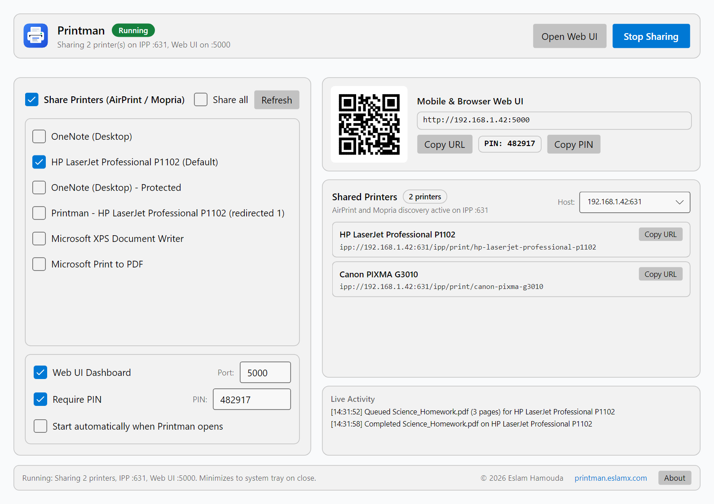

# Printman 🖨️

[](LICENSE)
[]()
[]()
[]()
[](https://github.com/EslaMx7/printman/releases/latest)
[](https://buymeacoffee.com/eslamx7)

Turn any USB printer into a **native Wi-Fi printer** for iPhone, iPad, Android, Windows, macOS, and Linux. Run **Printman Desktop** on the computer your printer is plugged into (no terminal required), or deploy the standalone CLI on a Raspberry Pi or headless server—your printer immediately appears in every device's built-in print dialog with **no phone apps, no extra drivers, and no cloud accounts**.

🌐 **Website:** [printman.eslamx.com](https://printman.eslamx.com) · 📖 **Guides:** [AirPrint & Mopria Setup](https://printman.eslamx.com/guides/share-usb-printer-airprint-mopria-windows) · 📝 **Changelog:** [printman.eslamx.com/changelog](https://printman.eslamx.com/changelog)

---

<p align="center">
  <a href="docs/images/printman_desktop_app_dark.png">
    <picture>
      <source media="(prefers-color-scheme: dark)" srcset="docs/images/printman_desktop_app_dark.png" />
      <source media="(prefers-color-scheme: light)" srcset="docs/images/printman_desktop_app_light.png" />
      
    </picture>
  </a>
</p>

## ⚡ Quick Start (60 Seconds)

1. **[Download Printman Desktop](#📥-download)** for Windows, macOS, or Linux. Make sure your USB printer already works on that computer.
2. **Launch and click Start Sharing** — tick the printer(s) you want to share, then click **Start Sharing**. Closing the window minimizes Printman quietly to your system tray or menu bar.
3. **Print from any device on the same Wi-Fi** — open **Print** in any app and pick **`Printman - <your printer>`**, or scan the QR code to upload documents from the Mobile Web UI.

| Your Device | How to Print |
| :--- | :--- |
| **iPhone / iPad** | AirPrint — Share → Print → pick `Printman - <printer>` |
| **Android** | Mopria / Default Print Service — Print → select the printer |
| **Windows 10 / 11** | Settings → Bluetooth & devices → Printers & scanners → Add device |
| **macOS** | System Settings → Printers & Scanners → Add Printer (Bonjour) |
| **Linux / ChromeOS** | Appears automatically as a driverless (IPP Everywhere) printer |

> **On a Raspberry Pi or headless Linux server?** Use the standalone CLI instead: `./printman share`

> Need step-by-step help? Check the [AirPrint / Mopria guide](https://printman.eslamx.com/guides/share-usb-printer-airprint-mopria-windows), [Android guide](https://printman.eslamx.com/guides/mopria-print-service-usb-printer-android), [Chromebook guide](https://printman.eslamx.com/guides/print-from-chromebook-to-usb-printer), [macOS guide](https://printman.eslamx.com/guides/print-from-mac-to-usb-printer-wifi), or [discovery troubleshooting](https://printman.eslamx.com/guides/usb-printer-not-showing-up-wifi-troubleshooting).

---

## 🖥️ Printman Desktop Highlights

- **System Tray & Menu Bar App:** Lives quietly in the background on Windows, macOS, and Linux with instant tray actions (`Open Printman`, `Start Sharing` / `Stop Sharing`, `Open Web UI`, `Copy PIN`, `Check for Updates`, and `Quit`).
- **Visual Printer Checklist:** Select your default printer, pick specific printers, or check **Share all** with live refresh.
- **QR Code, PIN & Browser Web UI:** Built-in LAN Web UI with instant QR code, masked tray PIN (`Copy PIN` without exposing digits on screen), and `Open Web UI` in your default browser.
- **Multi-Printer IPP URL Cards:** Host selector across LAN IPs and `.local` mDNS hostnames with one-click `Copy URL` per shared printer.
- **Live Activity & Startup Diagnostics:** Real-time print job activity log plus actionable Windows firewall or Linux/macOS CUPS setup guidance.
- **Built-in Update Checker:** Checks GitHub Releases on demand (or quietly at startup) from the **About** dialog.

---

## 📥 Download

Grab the latest standalone release from [**GitHub Releases**](https://github.com/EslaMx7/printman/releases/latest) (no .NET installation required, except the optional *Portable* zip):

### Desktop Tray App (Recommended)

| Platform | Download | Notes |
| :--- | :--- | :--- |
| **Windows (x64)** ⭐ | `printman-desktop-v*-win-x64.exe` | Standalone 64-bit Windows desktop tray app |
| **Windows (ARM64)** | `printman-desktop-v*-win-arm64.exe` | Snapdragon X / Copilot+ ARM64 Windows PCs |
| **macOS (Apple Silicon)** 🍏 | `printman-v*-osx-arm64.dmg` | Mountable `.dmg` with `Printman.app` + CLI (M1–M4 Macs) |
| **macOS (Intel)** | `printman-v*-osx-x64.dmg` | Mountable `.dmg` with `Printman.app` + CLI (Intel Macs) |
| **Linux (x86_64)** 🐧 | `printman-desktop-v*-linux-x64` | Standalone 64-bit Linux desktop tray app |
| **Linux (ARM64)** | `printman-desktop-v*-linux-arm64` | Standalone ARM64 Linux desktop tray app |

### Standalone CLI, Servers & Raspberry Pi

| Platform | Direct Binary | Archive | Notes |
| :--- | :--- | :--- | :--- |
| **Windows (x64 CLI)** | `printman-v*-win-x64.exe` | `.zip` | Standalone 64-bit Windows CLI |
| **Windows (ARM64 CLI)** | `printman-v*-win-arm64.exe` | `.zip` | Standalone ARM64 Windows CLI |
| **Windows (Portable Bundle)** | — | `-framework-dependent.zip` | Includes CLI + Desktop DLLs (requires .NET 10 Desktop Runtime) |
| **Linux (x86_64 CLI)** | `printman-v*-linux-x64` | `.tar.gz` | Standalone Linux x86_64 CLI |
| **Raspberry Pi (ARM64)** 🍓 | `printman-v*-linux-arm64` | `.tar.gz` | Raspberry Pi 3 / 4 / 5 (64-bit OS) |
| **Raspberry Pi (ARMv7)** | `printman-v*-linux-arm` | `.tar.gz` | Raspberry Pi 2 / 3 / 4 (32-bit OS) |
| **macOS (Apple Silicon CLI)** | `printman-v*-osx-arm64` | `.tar.gz` | Standalone ARM64 macOS CLI binary |
| **macOS (Intel CLI)** | `printman-v*-osx-x64` | `.tar.gz` | Standalone Intel macOS CLI binary |
| **Verification** | `checksums.txt` | — | SHA-256 hashes for every file in the release |

<details>
<summary><strong>OS Setup & Firewall Notes (Windows, Linux/Pi, macOS)</strong></summary>

- **Windows:** Launch `printman-desktop.exe` (or run `printman.exe share`). On first run, approve the Windows Firewall prompt for **Private** networks. If devices still cannot discover the printer, Printman displays the exact `netsh` rules needed.
- **Linux / Raspberry Pi:** Printman talks to your local **CUPS** print system. Install and start CUPS if it is not already installed:
  - **Debian / Ubuntu / Raspberry Pi OS:** `sudo apt install cups cups-filters && sudo systemctl enable --now cups`
  - **Fedora / RHEL:** `sudo dnf install cups cups-filters && sudo systemctl enable --now cups`
  - **Arch Linux:** `sudo pacman -S cups cups-filters && sudo systemctl enable --now cups`
  - **Alpine Linux:** `sudo apk add cups cups-filters && sudo rc-service cupsd start`
  - Add your printer in desktop settings or `http://localhost:631`, mark the binary executable (`chmod +x ./printman-desktop` or `chmod +x ./printman`), and launch it. If a firewall is active, allow IPP and mDNS: `sudo ufw allow 8631/tcp && sudo ufw allow 5353/udp` (plus `5000/tcp` if using the Web UI).
- **macOS:** Ensure your printer works in System Settings, then open `Printman.app` from the `.dmg` (or run `./printman share` in Terminal). If macOS Gatekeeper flags the unsigned app or binary on first launch:
  - Desktop App: `xattr -cr /Applications/Printman.app`
  - CLI Binary: `xattr -d com.apple.quarantine ./printman`

</details>

---

## 🔒 Privacy, Security & What to Expect

Printing sensitive documents (bills, IDs, school records) requires trust. Here is exactly how Printman behaves:

- **100% Local, Zero Telemetry:** Printman never collects analytics, telemetry, or prints through any external server. All print jobs and files stay strictly on your local Wi-Fi. (The optional **Check for Updates** action in the Desktop app only reads public release metadata from GitHub Releases.)
- **LAN-Only Access:** Connections from outside your private network (non-LAN IP addresses) are rejected automatically.
- **PIN Protection vs. Native Printing:**
  - **Web UI Dashboard** (`serve` / enabled by default in Desktop) is **PIN-protected** with an auto-generated 6-digit PIN. In the Desktop tray menu, click **Copy PIN** to copy without displaying digits on screen.
  - **Shared Network Printers** (`share`) **cannot require a PIN** because phone and OS print dialogs do not support typing one—anyone on your Wi-Fi can print to shared printers, just like a physical Wi-Fi printer.
- **Auto-Cleanup by Default:** Uploaded or IPP-cached print files are automatically deleted as soon as printing completes (unless `--keep-cache` / Keep Cache is explicitly enabled).
- **First-Run OS Warnings (Unsigned Binaries):** Printman is free open-source software without expensive corporate code-signing certificates, so your OS may warn you on first launch:
  - **Windows SmartScreen:** Click **More info** → **Run anyway**.
  - **macOS Gatekeeper:** Run `xattr -cr /Applications/Printman.app` (or `xattr -d com.apple.quarantine ./printman` for CLI).
  - You can verify every download against the SHA-256 `checksums.txt` published with every release.

---

## 🧭 Two Ways to Print (Both Built Into Desktop & CLI)

| | Network Printer (`share`) ⭐ | Mobile & Browser Web UI (`serve`) |
| :--- | :--- | :--- |
| **How you print** | Any app's **native Print dialog** | Upload files in a **mobile/desktop browser** |
| **PIN Protection** | No (works like a standard Wi-Fi printer) | **Yes** (auto-generated 6-digit PIN) |
| **Best for** | Seamless everyday printing from phones & laptops | Printing files directly, checking queue & hardware alerts |

Both toggles live side-by-side in **Printman Desktop**, or can be combined in one terminal command: `printman share --web` (or `printman serve --share`).

### Mobile Web UI

Need to upload PDFs, images, or text files from a phone browser—or monitor your printer queue and ink/paper alerts? Enable **Web UI Dashboard** in Printman Desktop (or run `printman serve`):

```bash
printman serve                        # Auto-generated 6-digit PIN on port 5000
printman serve --port 8080 --pin 123456
printman serve --no-auth              # Open home Wi-Fi access (no PIN)
```

<p align="center">
  <a href="docs/images/printman_mobile_web_dark.png">
    
  </a>
</p>

- **Supported Formats:** PDF, images (`.png`, `.jpg`, `.bmp`, `.gif`, `.tiff`), and plain text/code (`.txt`, `.csv`, `.md`, `.json`).
- **Live Spooler Queue & Diagnostics:** Real-time hardware status (Ready, Paper Jam, Out of Paper, Offline, Paused) and one-click job cancel or queue purge.
- **Duplicate Safeguard:** Warns before re-sending a file that is already pending on the printer.
- **Light & Dark Themes:** Automatically matches your device theme with a manual toggle.

---

## 🛠️ CLI, Headless Servers & Raspberry Pi

Running on a headless machine, SSH session, or Raspberry Pi? The standalone `printman` CLI provides full control without any GUI dependencies.

<p align="center">
  <a href="docs/images/printman_desktop_cli_share_dark.png">
    
  </a>
</p>

### Interactive Terminal Menu
Run `printman` with no arguments (or `printman -i`) to open the guided terminal launcher:
1. Start the Web UI
2. Share your default printer on the network
3. Pick specific printers from a checklist
4. Start Web UI + network sharing together
5. More tools (print a file, list printers, inspect capabilities, live queue watcher)

### Share Specific Printers
```bash
printman share                       # Share default printer
printman share "HP Laser" "Canon"    # Share by partial name
printman share --select              # Interactive checklist
printman share --all                 # Share all installed printers
printman share --web                 # Network printers + Web UI
```

### Print or Manage Queue from Terminal
```bash
printman "./doc.pdf"                                 # Print to default printer
printman "./doc.pdf" -p "HP Laser" -pages 1:3 -copies 2
printman list                                        # List installed printers
printman info "HP Laser"                             # Show supported paper sizes & capabilities
printman queue "HP Laser" --watch                    # Live spooler queue monitor
printman cancel 12                                   # Cancel job ID 12
printman purge "HP Laser"                            # Clear all jobs on a printer
```

### Run 24/7 on Linux or Raspberry Pi (`systemd`)

<details>
<summary><strong>Click to view systemd service setup</strong></summary>

1. Copy the CLI binary to `/usr/local/bin`:
   ```bash
   sudo cp printman /usr/local/bin/
   sudo chmod +x /usr/local/bin/printman
   ```
2. Create `/etc/systemd/system/printman.service`:
   ```ini
   [Unit]
   Description=Printman Universal AirPrint & Mopria Print Server
   After=network.target cups.service
   Wants=cups.service

   [Service]
   Type=simple
   ExecStart=/usr/local/bin/printman share --all
   Restart=always
   RestartSec=5
   Environment=DOTNET_CLI_TELEMETRY_OPTOUT=1

   [Install]
   WantedBy=multi-user.target
   ```
3. Enable and start:
   ```bash
   sudo systemctl daemon-reload
   sudo systemctl enable --now printman
   ```

</details>

---

## ⚙️ CLI Reference

### Commands
| Command | Aliases | Description |
| :--- | :--- | :--- |
| `share` | `share-select` (`share --select`) | Share printers as native network printers (AirPrint / Mopria / IPP Everywhere) |
| `serve` | `server`, `--serve` | Start the local PIN-protected mobile web UI |
| `queue` | `q`, `jobs` | Inspect spooler & pipeline queue (`--watch` for live updates) |
| `cancel` | `abort` | Cancel a print job by integer Job ID |
| `purge` | `clear-queue` | Clear all pending jobs on a printer queue |
| `list` | `-list`, `--list` | List all installed printers and status |
| `info` | `-info`, `--info` | Show supported paper sizes and capabilities for a printer |
| `interactive` | `-i` | Launch the interactive terminal menu |
| `version` | `-v`, `--version` | Show the Printman version |
| `help` | `-h`, `--help` | Show full command help |

### Key Flags

<details>
<summary><strong>Print Flags, Server Flags (<code>serve</code>), and Sharing Flags (<code>share</code>)</strong></summary>

#### Print Flags
| Option | Aliases | Description | Example |
| :--- | :--- | :--- | :--- |
| `-printer` | `-p`, `--printer` | Target printer name or partial match | `-p "HP Laser"` |
| `-pages` | `--pages` | Page range or individual pages | `-pages 1:3`, `-pages 2,5` |
| `-size` | `-s`, `--size` | Paper size name | `-size A4`, `-size Letter` |
| `-copies` | `-c`, `--copies` | Number of copies | `-copies 2` |
| `-orientation` | `-o`, `--orientation` | `portrait`, `landscape`, `auto` | `-o landscape` |
| `-duplex` | `-d`, `--duplex` | `simplex`, `vertical`, `horizontal` | `-d vertical` |
| `-color` | `--color` | `color`, `mono` | `-color mono` |
| `-dpi` | `--dpi` | PDF rendering DPI (Windows, default `300`) | `-dpi 300` |
| `-fit` | `-nofit` | Fit content to printable area (default `true`) | `-fit` |
| `-output` | `-out`, `--output` | Print to file (`cupsfilter` PDF on Unix, virtual printer on Windows) | `-output "out.pdf"` |

#### Web Server Flags (`serve`)
| Option | Description | Default |
| :--- | :--- | :--- |
| `--port`, `-p` | Local web server port | `5000` |
| `--ip`, `--bind` | Network binding address | `0.0.0.0` |
| `--pin` | Custom access PIN | Auto-generated 6-digit PIN |
| `--no-auth` | Disable PIN protection | Disabled |
| `--max-upload-mb` | Maximum file upload size in MB | `50` |
| `--cache-limit-mb` | Maximum disk cache size in MB | `500` |
| `--keep-cache` | Retain cached files after printing (off by default for privacy) | Off |
| `--share [printer]` | Also share a printer on the network (repeatable) | Off |
| `--share-select` | Also share printers from an interactive checklist | Off |

#### Network Sharing Flags (`share`)
| Option | Description | Default |
| :--- | :--- | :--- |
| `[printer ...]` | Printers to share (partial names work) | System default printer |
| `--select` | Pick printers from an interactive checklist | Off |
| `--all` | Share every installed printer | Off |
| `--web`, `--ui` | Also start the Web UI (accepts `serve` flags) | Off |
| `--ipp-port` | IPP network printing port | `631` (Windows), `8631` (Linux / macOS) |
| `--no-mdns` | Disable mDNS announcement (connect by IPP URL only) | Announce on |
| `--keep-cache` | Retain cached files after printing (off by default for privacy) | Off |
| `--ip`, `--bind` | Network binding address | `0.0.0.0` |

</details>

---

## 💡 Why Printman?

> *"Do not replace reliable hardware. Modernize the access layer."*

In 2014, I bought an **HP LaserJet Professional P1102**. Over 12 years later, it still prints reliably on a single toner cartridge that lasts for years—but it only has a USB port, and modern macOS/Linux drivers are gone. Meanwhile, newer Wi-Fi printers are often expensive, fragile, or locked behind cloud accounts.

Instead of throwing away solid hardware, I built **Printman** so my family can print school homework directly from their phones and iPads over Wi-Fi without installing anything.

---

## 🔨 Building from Source

**Requirements:** [.NET 10 SDK](https://dotnet.microsoft.com/) (and CUPS at runtime on Linux/macOS/Raspberry Pi).

```bash
# Build & run all unit + Desktop UI tests
dotnet build Printman.slnx
dotnet test Printman.slnx

# Run Desktop GUI or CLI locally
dotnet run --project src/Printman.Desktop
dotnet run --project src/Printman -- list

# Publish Desktop App (replace <rid> with win-x64, win-arm64, linux-x64, linux-arm64, osx-arm64, osx-x64)
dotnet publish src/Printman.Desktop/Printman.Desktop.csproj -c Release -r <rid> --self-contained true -p:PublishSingleFile=true -o ./publish/<rid>-desktop

# Publish standalone CLI executable (note: src/Printman has zero third-party NuGet dependencies)
dotnet publish src/Printman/Printman.csproj -c Release -r <rid> --self-contained true -p:PublishSingleFile=true -o ./publish/<rid>-cli
```
> **macOS note:** Publish macOS binaries on a Mac so the SDK signs them (Apple Silicon refuses to run unsigned binaries). On macOS desktop publish, omit `-p:IncludeNativeLibrariesForSelfExtract=true`.

---

## 📄 License, Contributing & Support

- **License:** MIT — see [LICENSE](LICENSE).
- **Contributing:** Issues and pull requests are welcome! See [CONTRIBUTING.md](CONTRIBUTING.md) (and [AGENTS.md](AGENTS.md) for AI coding assistant rules).
- **Support:** Need help? Open an issue or email [support@eslamx.com](mailto:support@eslamx.com). If Printman saved you time or rescued an old printer, consider [buying me a coffee](https://buymeacoffee.com/eslamx7) ☕.

> *Built with AI assistance using Antigravity powered by Gemini.*
